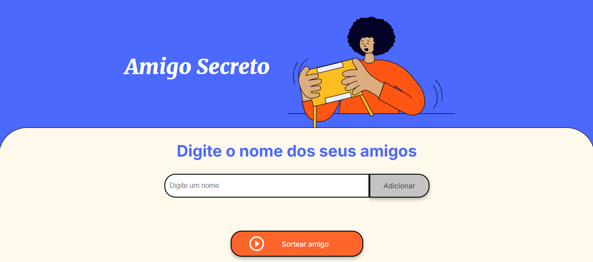
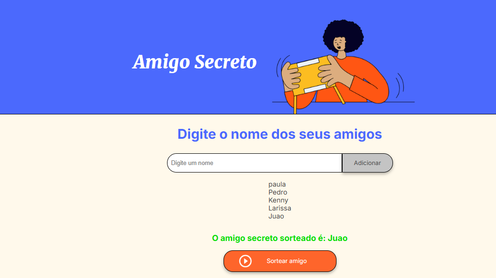

# Amigo Secreto

Este projeto é uma aplicação simples para realizar sorteios de "Amigo Secreto", permitindo adicionar participantes e visualizar quem tirou quem de forma aleatória e justa.

## Funcionalidades
- Adicionar participantes à lista.
- Realizar o sorteio dos amigos secretos de forma aleatória.
- Exibir os resultados com os respectivos nomes.

## Como Usar

### Adicionar Participantes
1. Ao iniciar a aplicação, você será solicitado a inserir o nome dos participantes.
2. Digite o nome de cada participante no campo de texto e clique em "Adicionar". Repita até que todos os nomes sejam adicionados.
3. A lista com os participantes aparecerá abaixo do campo de entrada.

### Realizar o Sorteio
1. Após adicionar todos os participantes, clique em "Realizar Sorteio".
2. O sistema irá sortear os amigos secretos e exibirá quem tirou quem.

## Capturas de Tela

*Tela onde você pode adicionar os participantes.*

*Exibição dos resultados após o sorteio.*

## Como Rodar o Projeto

1. Clone o repositório:
git clone https://github.com/nataliaCardosoo/Amigo_Secreto.git
2. Abra o projeto na sua IDE preferida, como o **Visual Studio Code**.
3. Não é necessário compilar, pois o projeto é uma aplicação **front-end** (HTML, CSS e JavaScript).
4. Abra o arquivo `index.html` diretamente no navegador ou use a funcionalidade Live Server do Visual Studio Code para testar.
5. Siga as instruções na interface para adicionar os participantes e realizar o sorteio.

## Tecnologias Utilizadas
- **HTML**: Para estruturar a página.
- **CSS**: Para estilizar a página e torná-la visualmente agradável.
- **JavaScript**: Para lógica de sorteio e interação com o usuário.

